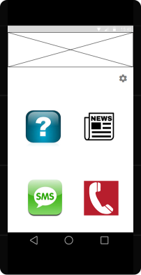

# Design #

## Data 
 
### Van buitenaf
- Data vragen hard coden in een ArrayList<String>: http://www.rsdnation.com/psychopathic/blog/101-unique-questions-ask-first-date. Om de beurt 1 laten zien.
Favorieten opslaan in een andere ArrayList<String> voor constant ListView
- nieuws: NOS news RSS feed http://feeds.nos.nl/nosjournaal

### Opslaan
- SQLiteDatabase: opslaan vragen / favoriete vragen / contact/ text sms
- contact selection emergency sms gebruik permission in manifest:
<uses-permission android:name= "android.permission.READ_CONTACTS"/>
Gebruik functies/intents voor ophalen contacten. Wacht op resultaat en roep functie voor contactSelection aan. 

## Overzicht Structuur

#### Objects

#### Activities & Views

## Detail Sketches
#### Main Screen
Nog logo ontwerpen en mooie images zoeken voor de image buttons. 

#### Settings Screen
Gaat nog veranderen als het duidelijk is hoe ik ga zoeken naar contacten, ga ik naar de app toe of laad ik alle contacten en kan ik dan daar doorheen scrollen of zoeken met een toetsenbord? 

#### News Screen
Inhoud is een lijst met News (object) items die bestaan uit een titel, link en beschrijving.

#### Fake Call Screen
Voorbeeld is van een uitgaand gesprek, maar dit wordt een inkomend gesprek. Ongeveer het zelfde, alleen is het telefoon icoontje in het midden grijs en wordt die groen/rood voor links/rechts opnemen/ophangen.

 
#### Questions Screen
Met de button huidig gedisplayde vraag opslaan in de favorieten lijst onderaan het scherm. 

 

## Database format 
Ik ga een database gebruiken met 2 tabellen erin. De Questions Table heeft 101 rijen om allen questions op te slaan met een id, een string en een boolean. De boolean wordt gebruikt om aan te geven of het een favourite is of niet. De Settings table wordt gebruikt om alle instellingen op te slaan. 
Links op de afbeelding staat de indeling van de Questions table weergegeven en rechts de indeling van de Settings table. 

