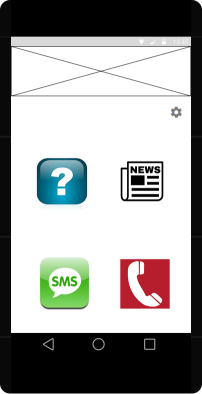

# project mprog : save the night!
Het maken van mijn eigen app. Onderdeel van het afsluitende vak Programmeerproject van de minor programmeren.
 
Lydia Wolfs

Student nummer: 10338217

##Beschrijving 
 Als de gebruiker van deze app een hele slechte date heeft geeft deze app de oplossing in meerdere richtingen: 2 opties om de date nog de goede kant op te sturen via suggesties en 2 om de app zo snel mogelijk af te breken. 

#### Features
Het implementeren van een fake call. Dit is een nagemaakt scherm. 
Het laten sturen van een ready to go emergency sms naar vantevoren gekozen nummer uit je telefoonboek. Hierdoor hoef je niet ongemakkelijk nog een sms te typen en een contactpersoon te kiezen. 
Het ophalen van lokaal news voor een interessant gespreksonderwerp. 
Een voorstel voor een interessante eerste date vraag om je date een beetje los te krijgen. 

## Design
Main scherm

Settings scherm

Nep incoming call scherm

Nieuws scherm

Questions scherm

- *Welke datasets en data sources zijn er nodig en hoe wordt de data aangepast naar een goed format voor de app?*  
Dataset met news, een dataset met date vragen, een dataset met telefoonnummers die je binnenhaalt vanaf je eigen telefoon. In een SQLiteDatabase worden 2 tabellen gemaakt met alle info. 

- *Welke losse onderdelen van de applicatie kunnen worden onderscheiden en hoe moeten deze samenwerken?* Begin scherm waarin keuze wordt gemaakt tussen  de hulp opties (icons). 3 van de 4 hulp opties hebben ook ieder een eigen scherm. Alleen de emergency sms moet  via de sms app weer terug komen bij de 4 hulp opties Scherm. Terug gaan is altijd mogelijk via back button. Bij het afsluiten van de app komt de gebruiker weer bij het begin scherm. Bij de instellingen misschien nog een uitstap naar de contacten app. 

- *Welke externe onderdelen (API's) zijn nodig om de features mogelijk te maken?*
**NOS nieuws RSS feed** Hiermee wordt het recente Nederlandse nieuws opgehaald. 

- *Noem technische problemen of limitaties optreden tijdens het ontwerpen van de applicatie.Welke oplossingen zijn er om dit op te lossen.*
Als het niet lukt om GPS te gebruiken of om lokaal nieuws op te halen, dit een standaard ingegeven locatie of standaard website front page zijn (via instellingen) en dan wordt altijd dezelfde (geupdate) query uitgevoerd. 
Als het niet lukt om een echte call uit te voeren via GMAIL VOICE kan er ook een plaatje full screen worden weergegeven die lijkt op een incoming call screen en deze wordt vergezeld met een ringtone. Of eventueel een animatie, en geen stilstaande afbeelding. 
Als het niet lukt om een echte sms te sturen, moet dit ook worden gefacked met behulp van een afbeelding en een geluidje. 

##Een review van vergelijkbare applicaties##

**fake a call free** "Fake an incoming call and get away from any situation!
The original and still the best, and free!
*Autofill from contacts
*Select your own ringtones
*Record 'voice on other end'
*Schedule fake calls
Fake-A-Call at your next meeting, class, or awkward date!" 

Hierbij kan een timer worden gezet en een belletje worden nagemaakt met contactenlijst en een nep stem aan de andere kant. 

**My First Date Questions**: Deze app heeft 101 vragen gehardcoded en in een list view gezet. Je kan erdoor heen scrollen en zo je date verder helpen. Ook kan je favorieten opslaan, want het terugzoeken makkelijker maakt. 

##minimum viable product (MVP)##
Een app vanuit een begin scherm 

1) van een standaard locatie nieuws ophaalt 

2) gehardcode vragen random 1 voor 1 laat zien door op een knop te drukken.

3) een standaard android incoming call screenshot displayed met bijpassen geluid.  

4) extern een sms versturen 
