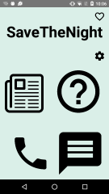
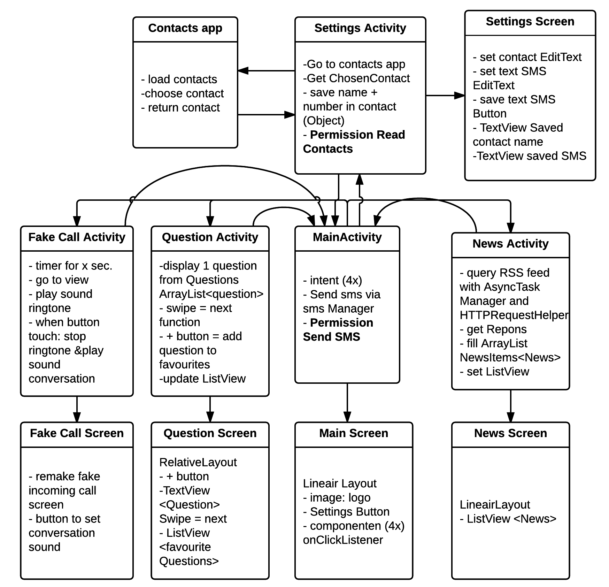
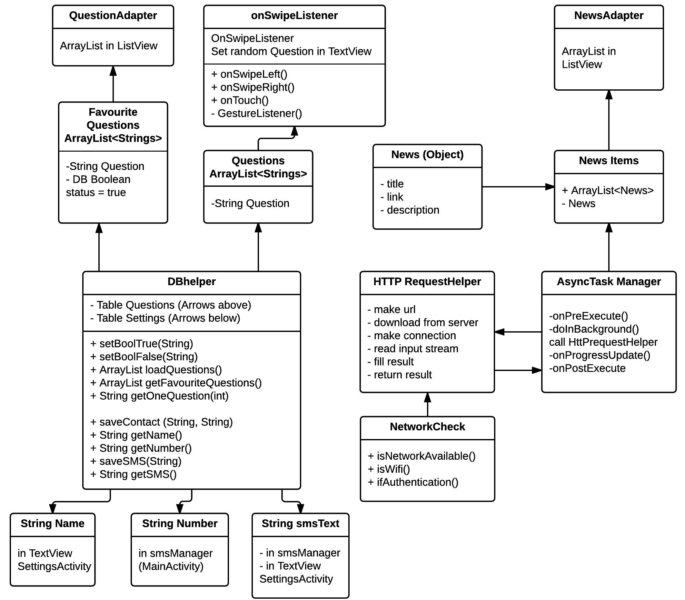

# Report SaveTheNight #
 

#### Description
When an user of the app has a really bad date, but wants to save their night, this app has 4 different solutions. There are 2 possibilities to get out of the date and 2 to help the date forward. By user of the four icon in the screen centre, any of there can be put in action. 

#### Features
This app knows 4 features: 

1. By clicking on the newspaper-icon on the main screen, the current news is loaded into a new screen. At least you have something to talk about know. If you want the full article, just click on the title of the news item. 
2. Is the user ready for some more spicy conversation, then the questionmark-icon can be pressed. This loads 101 dating questions, showed 1 by 1 on the screen. If an user likes a question, it can be saved and showed in a list on the bottom of the screen by pressing on the star-button. Swiping the question to the left shows the previous questions and swiping to the right shows the next question.
3. The fake call: when the user presses the phone-icon, a new screen is initialized after a short delay. The app addapts to the user volume settings and plays a ringtone, vibrates or stays quite during the fake call. This is the perfect time to lose this horrible date of yours!
4. Via the settings-icon in the top right of the app, a user can select a contact from the contact list and type an emergency sms previous to the date. By pressing the sms-icon on the main screen, the sms will automatically be send, so your hero can come to recue you. 

## Technical Description##
#### Overview Activities

#### Overview connections Objects & classes

## Challenges during development & Argument ##
In an ideal world I would have made an English and a Dutch version. Now everything is in English exept the news, which is in Dutch. I could not find an API for date questions, so they are hardcoded and not translatable. If I had more time I would have put more time in investigation website API's to get local news. There is no API for whole Netherlands, Europe or world to get local news via GPS information.
Also I would like to implement an better fake call, with a fake caller audio so you can fake getting called with a fake response from 'the other side'. 

During the development I changes some of my other technical designs. First it looked impossible to send an previously typed en saved sms to a chosen contact without leaving the app. But I found a class: smsManager that does this for you. This meant the smsActivity and screen were not necessary anymore. Though sending an sms itself was easy, it was difficult to retrieve the response when everything did not go as planned. I did not tested this until day 18 when I was able to put a working simcard in my test phone. 
I also dropped some of my objects (like Question Object) and put more of my functionality in the Database (10 functions with queries, instead of 3). This made the technical design a lot more clear and clean. Loosing the question Object was possible when I started using a primairy integer as key and a boolean to save whether a question is favourite or not. There was no permanent ArrayList with favourite quesitons needed anymore, just a temporary one to fill the ListView
For the fake call, there are easy ways to get information from the phone to get user settings on notification volume via an AudioManager Class and GetSystemService(). Next was playing the users set ringtone or vibrating the phone. The user's ringtone was found via a RingtoneManager class and played by a Mediaplayer class. Vibrating the phone needed a permission but could easily be activated via Vibrator.vibrate(). To make it more real, an delay was implemented after the phone-icon was pressed via a Handler class and .postdelayed(). 
Another permission was needed to select a contacts from the contacts app on the phone. 

The biggest problem during the development of my app was parsing the rss feed from nos.nl. For this parsing I needed an XML parser. I started out with a basic structure of parsing JSON, a HTTPrequest helper + AsynTask Manager.I added an NewsItem object with functions of an specific XMLpullparser combined with an extra XMLParser class to extend this JSON parser to an XML parser and a new specific AsyncTask matching these functions. This made the structure a lot more complicated.  I made another AsyncTask class, with less functions and without the functions in the NewsItem object. At this time I was able to get one title in the screen (ListView) but the parser never reach the next Start Tag in the XML file (Day 7). 
At Day 9 I added a new xmlPullParser with smaller, cleaner functions in 1 file. Now I did not get any result in the screen and again skipping the Tags seemed to be the problem. 
Another problem I encountered along the way was a specific problem with the Science Park open Wifi source. Since my testing phone did not have a network simcard, the public Wifi was used for testing. When a user is not registered to this source, a HTTP request returned a XML response with information about the public Wifi Network, so ofcourse my Start Tags of interest were not found by the XML parser. 
At Day 12 I started over and went back to the beginning with a simple HTTP-request helper (stolen from a JSON assignment) and made a XMLPullparser inside a simple AsyncTask file. This time I used a switch-case structure to look for my Start Tags of interest. Still the skipping over tags seemed to be the problem and it became more clear that the structure of my XML response file was making this hard. After playing around with different "go to next" attributes, it finally worked. At day 13 the newsItems wel clean loaded into the ListView. On day 14, the title of the newsItems was clickable to the loaded link derived from the XML inputStream. 
At the end of the day, XML parsing set upis not that hard itself  when using an XML pull parsen, but seeking through the structure of the XML response is the hard bit. 

Some other difficulties during the development where the permission requests. Handling the response of reading contacts list and sending sms, was a lot more complicated then expected. Retrieve a name and a number from a selected contact included a lot of steps and controls. The actions were not stable to handle stupid things a user would do, so a lot of error handling was needed.

Another major project was the database. I changed the content of the database a lot during the development and it was a bit of a hassle to find a clean way to save everything (expect when deinstalled) and when needed overwrite specific rows of the database. In the end it was best to extend the functionality in Database Helper file for a better separation of concerns. 

